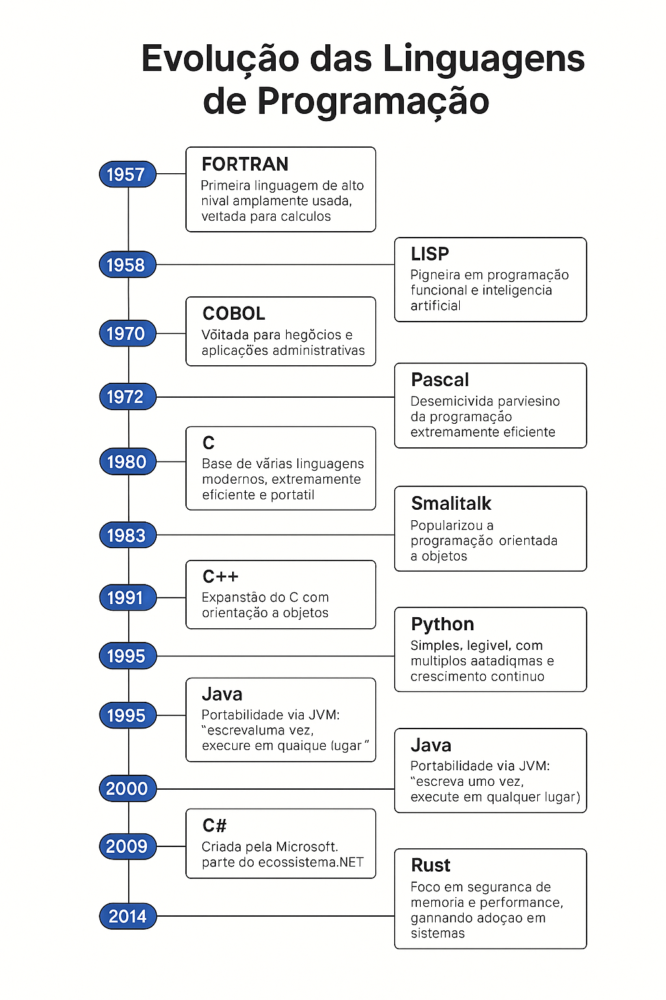

# 01 - Introdução às Linguagens de Programação

Este material apresenta uma introdução às linguagens de programação, com foco na sua evolução histórica e nos marcos mais relevantes que influenciaram o desenvolvimento da computação moderna.

---

## Linha do Tempo das Linguagens de Programação

| Ano  | Linguagem      | Marco Importante                                                                      |
| ---- | -------------- | ------------------------------------------------------------------------------------- |
| 1957 | **FORTRAN**    | Primeira linguagem de alto nível amplamente usada, voltada para cálculos científicos. |
| 1958 | **LISP**       | Pioneira em programação funcional e inteligência artificial.                          |
| 1959 | **COBOL**      | Voltada para negócios e aplicações administrativas.                                   |
| 1970 | **Pascal**     | Desenvolvida para ensino da programação estruturada.                                  |
| 1972 | **C**          | Base de várias linguagens modernas, extremamente eficiente e portátil.                |
| 1980 | **Smalltalk**  | Popularizou a programação orientada a objetos.                                        |
| 1983 | **C++**        | Expansão do C com orientação a objetos.                                               |
| 1991 | **Python**     | Simples, legível, com múltiplos paradigmas e crescimento contínuo.                    |
| 1995 | **Java**       | Portabilidade via JVM: “escreva uma vez, execute em qualquer lugar”.                  |
| 1995 | **JavaScript** | Criada para web, hoje usada também no backend (Node.js).                              |
| 2000 | **C#**         | Criada pela Microsoft, parte do ecossistema .NET.                                     |
| 2009 | **Go**         | Desenvolvida pelo Google, foca em desempenho e simplicidade.                          |
| 2014 | **Swift**      | Linguagem moderna para desenvolvimento Apple (iOS/macOS).                             |
| 2014 | **Rust**       | Foco em segurança de memória e performance, ganhando adoção em sistemas.              |

---

# 🔎 Informações Adicionais

## FORTRAN

FORTRAN (_Formula Translation_), criada pela IBM sob a liderança de John Backus, foi a primeira linguagem de alto nível a ganhar ampla aceitação. Projetada para aplicações científicas e de engenharia, ela tornou possível escrever programas complexos de forma mais compreensível do que com Assembly. Seu compilador foi um dos primeiros a realizar otimizações automáticas de código. FORTRAN continua sendo usada em áreas como modelagem climática, simulações físicas e cálculos numéricos intensivos.

---

## LISP

LISP (_LISt Processing_), criada por John McCarthy, é a segunda linguagem de programação de alto nível mais antiga ainda em uso. Pioneira na programação funcional, LISP introduziu conceitos como recursão, coleta de lixo (garbage collection) e o uso de listas como estrutura de dados primária. É historicamente ligada à pesquisa em inteligência artificial e aprendizado de máquina, e inspirou muitas outras linguagens modernas, como Scheme, Clojure e até funcionalidades do JavaScript.

---

## COBOL

COBOL (_Common Business-Oriented Language_) foi projetada por uma comissão liderada por Grace Hopper, com foco em aplicações empresariais, como bancos, governos e grandes corporações. Sua sintaxe foi projetada para ser legível como o inglês natural, facilitando a manutenção por pessoas com menos formação técnica. Embora considerada antiquada, milhões de linhas de código COBOL ainda estão em operação em sistemas legados financeiros e governamentais.

---

## Pascal

Criada por Niklaus Wirth, Pascal foi desenvolvida com fins educacionais, visando o ensino de boas práticas de programação estruturada. Sua estrutura clara e rigorosa ajudava os alunos a compreenderem conceitos como escopo de variáveis, sub-rotinas e modularidade. Apesar de não ser amplamente utilizada na indústria, foi fundamental na formação de gerações de programadores e inspirou o desenvolvimento de linguagens como Delphi e Modula-2.

---

## C

C, desenvolvida por Dennis Ritchie nos laboratórios Bell da AT&T, foi criada para implementar o sistema operacional UNIX. Extremamente poderosa, oferece controle direto sobre a memória e recursos do sistema. Tornou-se a base para muitas outras linguagens (como C++, Java e C#) e continua amplamente utilizada em sistemas operacionais, drivers e sistemas embarcados.

---

## Smalltalk

Smalltalk foi a primeira linguagem a implementar totalmente o paradigma da programação orientada a objetos (POO). Criada por Alan Kay e sua equipe no Xerox PARC, introduziu conceitos fundamentais como objetos, classes, mensagens e herança. Influenciou fortemente linguagens modernas como Ruby, Python, Objective-C e Java.

---

## C++

Criada por Bjarne Stroustrup como uma extensão da linguagem C, C++ adicionou suporte à programação orientada a objetos. Combinando desempenho de baixo nível com abstrações de alto nível, é amplamente usada no desenvolvimento de sistemas, jogos, aplicações gráficas e softwares de alto desempenho. Permite programação procedural, orientada a objetos e genérica.

---

## Python

Python foi criada por Guido van Rossum com foco em legibilidade e simplicidade. Suporta múltiplos paradigmas (orientado a objetos, funcional, imperativo) e é amplamente usada em áreas como ciência de dados, automação, desenvolvimento web e inteligência artificial. Sua filosofia de design prioriza código limpo, claro e de fácil manutenção.

---

## Java

Java foi criada pela Sun Microsystems com o lema "escreva uma vez, execute em qualquer lugar", graças à Java Virtual Machine (JVM). Com forte tipagem e sintaxe inspirada em C++, é orientada a objetos e tem foco em portabilidade, segurança e robustez. É usada em aplicações corporativas, Android, sistemas embarcados e muito mais.

---

## JavaScript

JavaScript, criado por Brendan Eich em apenas 10 dias, foi inicialmente projetado para adicionar interatividade a páginas web. Com o tempo, evoluiu para uma linguagem completa, usada no backend (Node.js), frontend (React, Vue, Angular), aplicações móveis e desktop. Suporta programação funcional, orientada a objetos e assíncrona (event loop, Promises, async/await).

---

## C#

Desenvolvida pela Microsoft como parte da plataforma .NET, C# é uma linguagem moderna, orientada a objetos e fortemente tipada. Combina elementos de C++, Java e Delphi. Ideal para desenvolvimento de aplicações Windows, web (ASP.NET), jogos (Unity), e sistemas corporativos.

---

## Go (Golang)

Criada pelo Google por Robert Griesemer, Rob Pike e Ken Thompson, Go foi projetada para ser simples, eficiente e escalável. Tem sintaxe clara, gerenciamento de memória automático e suporte nativo a concorrência (goroutines). É muito usada em serviços de rede, sistemas distribuídos e infraestrutura de servidores em larga escala.

---

## Swift

Swift foi criada pela Apple para substituir o Objective-C no desenvolvimento de aplicações iOS e macOS. Combina segurança, desempenho e sintaxe moderna. Suporta programação funcional e orientada a objetos, e permite desenvolvimento rápido e seguro de aplicações móveis Apple.

---

## Rust

Rust foi desenvolvida pela Mozilla com foco em segurança de memória sem usar coletor de lixo. Evita erros comuns como _null pointer_ e _data race_, oferecendo desempenho comparável ao C/C++. Cresce rapidamente em projetos de sistemas, servidores e compiladores, sendo considerada uma das linguagens mais amadas por desenvolvedores.
