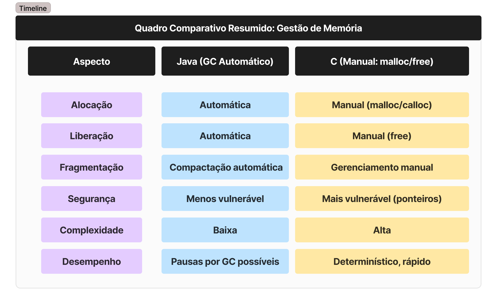

# Comparação de Gestão de Memória: Java vs C

Compara aspectos fundamentais da gestão de memória entre **Java** (com Garbage Collection automático) e **C** (utilizando `malloc`/`free` manual).

---

## Visão Geral

- **Java** utiliza coleta automática de lixo (Garbage Collection) via JVM, liberando memória de objetos inacessíveis.
- **C** exige alocação (`malloc`, `calloc`, `realloc`) e liberação (`free`) manuais, sem gerenciamento automático

---

## Java (Coleta automática – Garbage Collection)

- **Alocação**  
  Objetos são criados na heap via `new`. A memória é automaticamente atribuída sem intervenção direta do desenvolvedor.

- **Liberação**  
  A JVM identifica objetos inalcançáveis (não mais referenciados) e os remove automaticamente usando algoritmos como mark-and-sweep, geração (young/old) e coletores modernos como G1, ZGC e Shenandoah.

- **Algoritmos de coleta**  
  Incluem Mark & Sweep, coletores geracionais, Serial, Parallel, CMS, G1 (padrão desde Java 9), ZGC (desde Java 11) e Shenandoah (desde Java 12).

- **Fragmentação e compactação**  
  O coletor compacta a heap realocando objetos para reduzir fragmentação e melhorar localidade de memória.

- **Impacto no desempenho**  
  Pode ocorrer pausas “stop‑the‑world” durante coleções (especialmente Major GC); coletores modernos buscam minimizar isso com alta o throughput.

- **Segurança e robustez**  
  A ausência de ponteiros explícitos e a gestão automática evitam erros como dangling pointers ou liberação dupla.

- **Complexidade para desenvolvedor**  
  Baixa: gerenciamento transparente pelo runtime, permitindo foco na lógica da aplicação.

---

## C (Alocação manual via `malloc`/`free`)

- **Alocação**  
  O programador utiliza `malloc`, `calloc` ou `realloc` para reservar memória dinamicamente na heap.

- **Liberação**  
  Deve ser feita manualmente com `free()`. Esquecer ou repetir liberações acarreta vazamentos de memória ou corrupção (segfaults).

- **Fragmentação e compactação**  
  Não há relocação automática; fragmentação deve ser gerenciada pelo uso cuidadoso de alocadores ou práticas de código.

- **Coletores**  
  Linguagem sem GC nativo; embora existam coletores externos (e.g. Boehm), não são comuns em uso padrão.

- **Impacto no desempenho**  
  Geralmente alta performance e previsibilidade, sem pausas por GC. Porém exige código cuidadoso para evitar erros críticos.

- **Segurança e robustez**  
  Exposição de ponteiros e acesso manual a memória tornam mais suscetível a vulnerabilidades como buffer overflow e uso após free.

- **Complexidade para desenvolvedor**  
  Alta: requer gerenciamento rigoroso do ciclo de vida da memória, uso correto de ponteiros e ferramentas como Valgrind para debugging.

---

## 📝 Resumo Comparativo

- **Java** oferece conveniência, abstraindo completamente o gerenciamento manual e reduzindo erros comuns, mas pode introduzir pausas imprevisíveis e overhead dependendo do coletor utilizado.
- **C** proporciona controle preciso e desempenho determinístico, porém requer disciplina e atenção ao ciclo de memória para evitar bugs e falhas críticas.

